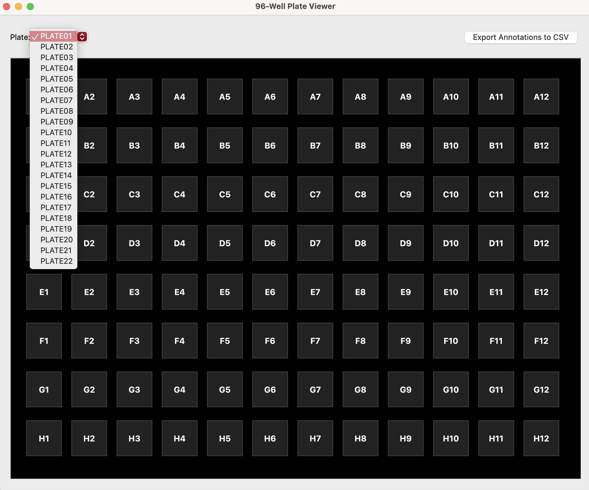
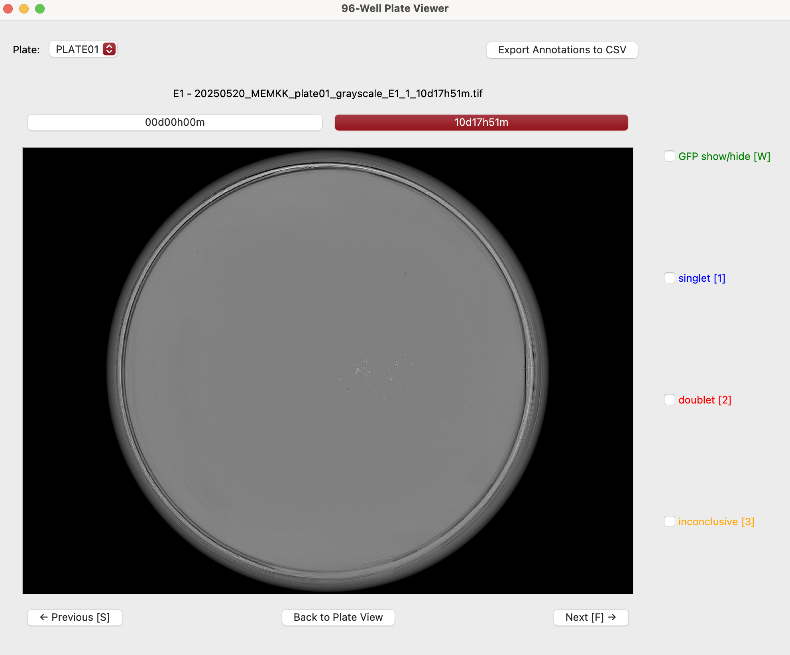
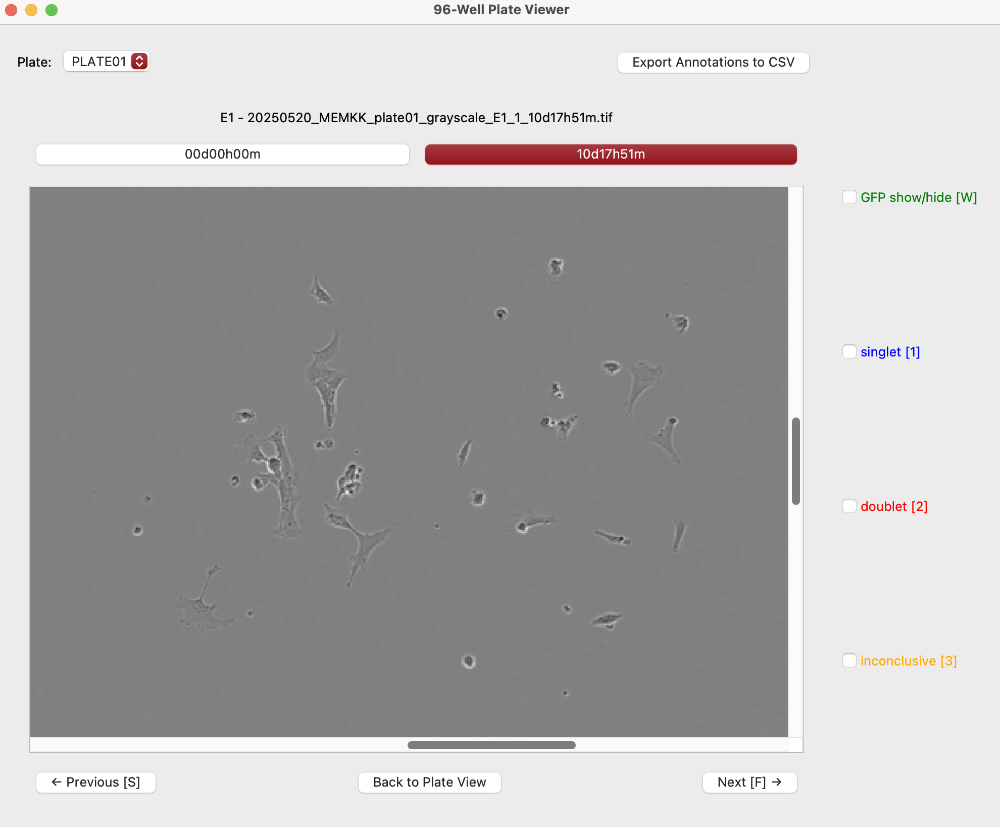
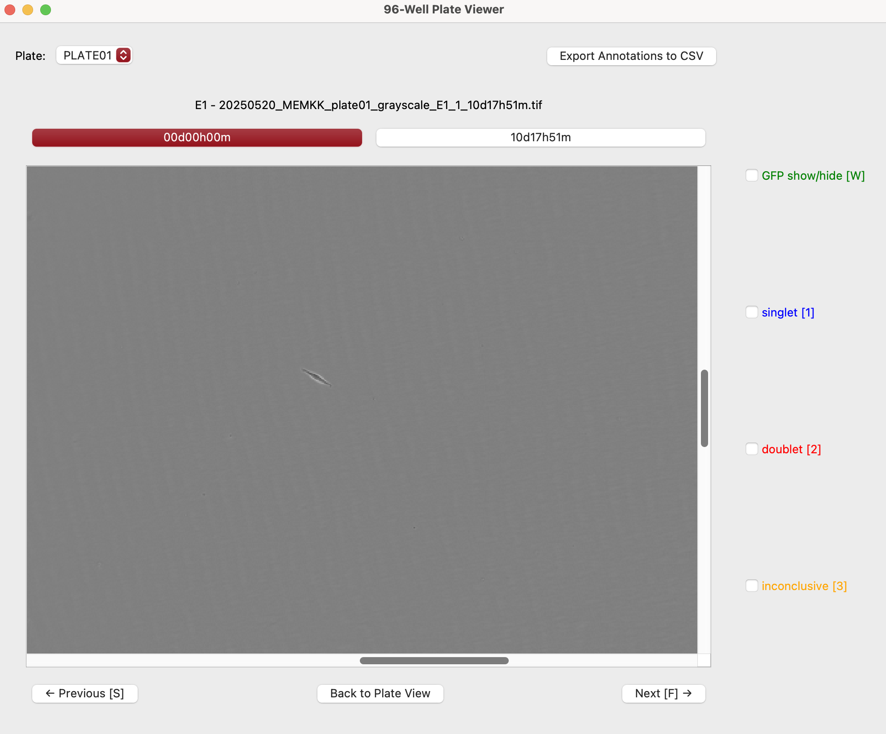
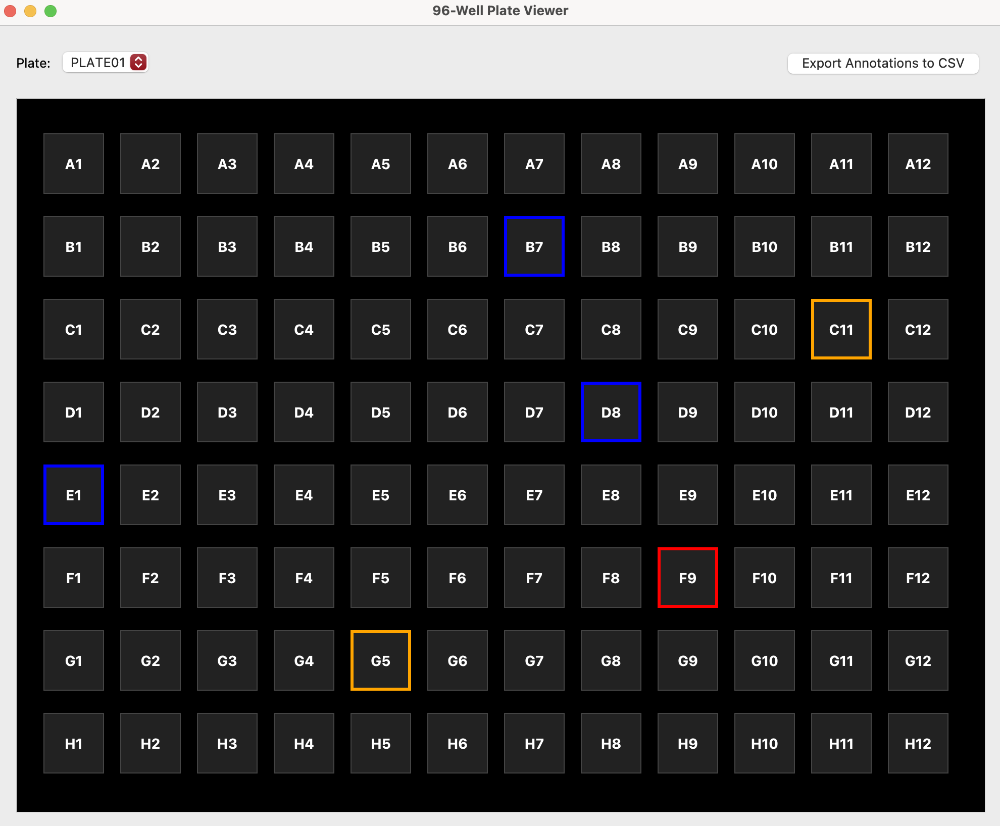

# 96-Well Plate Viewer (PyQt)

This desktop application allows you to browse image datasets from high-content microscopy (e.g., Incucyte) using a plate-based interface.

---

## Features

* Plate overview with clickable wells arranged in standard 96-well plate layout (8x12)
* Full-resolution zoomable view per well with timepoint toggling
* **Zoom state is preserved when toggling between timepoints**—focus stays on your region of interest
* Well annotation options: **singlet [1]** (blue box), **doublet [2]** (red box), **inconclusive [3]** (orange box)
* Colored ring indicators on plate view based on annotations
* **Export annotations to CSV** with plate+well and annotation type
* Keyboard shortcuts for fast navigation and annotation

---

## File format requirements

Each image filename must include:

* The word `plate` (case-insensitive), followed by a plate identifier (e.g., `PLATE01`)
* A well ID in the format `A1`–`H12`
* A timepoint in the format `00d00h00m`

**Example:**

```
20250117_MEM1003_plate01_A7_1_12d23h59m.tif
```

Other filename content is allowed, but the three components above must be present.

**Optional: View the GFP channel**

* If you want to display a GFP overlay for a well/timepoint, include `GFP` (case-insensitive) somewhere in the filename for that image.
* Any image **without** `GFP` in the filename is treated as a grayscale (brightfield) image by default.
* You do **not** need to include "grayscale" in filenames—grayscale is assumed unless "GFP" is present.

---

## First time setup

1. **Install Python:**  
   Download and install Python 3.7 or newer from [python.org](https://www.python.org/downloads/).

2. **Open a terminal or command prompt:**  
   On Mac, open Terminal. On Windows, open Command Prompt.

3. **Install dependencies:**  
   Run the following command:
   ```bash
   pip install PyQt5 Pillow
   ```

---

## Launch the app

```bash
python plateViewer.py
```

---

## Select image folder

* When prompted, select the folder containing your `.tif` images.
* The app could take a few seconds to load up depending on the number of plates you have.

---

## Browse plates


* Use the dropdown menu at the top to switch between plates.
* Click any well to open its images. (Note: well A1 is pre-cached and is fastest to start with)

---

## Navigate timepoints



* Use the timepoint buttons above the image.
* Or use the keyboard:

  * **A** → Previous timepoint
  * **D** → Next timepoint

* Scroll to zoom in and out of areas of interest.

  *Zoom state is preserved when switching timepoints.*

<table>
  <tr>
    <td>
      
    </td>
    <td>
      
    </td>
  </tr>
</table>

---

## Navigate between wells

* Use the **← Previous** and **Next →** buttons below the image.
* Or use the keyboard:

  * **S** → Previous well
  * **F** → Next well


---

## Toggle GFP overlay (if applicable)

* Use the checkbox or press **W** to show/hide the GFP overlay.

---

## Label wells

* Use the labeled checkboxes in well view:

  * 🟦 **singlet** → press **1**
  * 🟥 **doublet** → press **2**
  * 🟧 **inconclusive** → press **3**

* The selected well gets annotated with a colored outline in plate view, and logged in a later downloadable .csv format.



---

## Export annotations

* Click **Export Annotations to CSV** (top bar) to save a spreadsheet of all marked wells.
* The CSV will have two columns:
  * `clone` (e.g., `1A1`, `2C3`)
  * `incucyteNote` (`singlet`, `doublet`, or `inconclusive`)

---

## Return to plate view

* Click **Back to Plate View** to go back.

---

## Keyboard shortcuts

| Key         | Action                                 |
|-------------|----------------------------------------|
| **A**       | Previous timepoint                     |
| **D**       | Next timepoint                         |
| **S**       | Previous well                          |
| **F**       | Next well                              |
| **W**       | Toggle GFP overlay                     |
| **1**       | Mark as Singlet (blue)                 |
| **2**       | Mark as Doublet (red)                  |
| **3**       | Mark as Inconclusive (orange)          |
| **Ctrl+E**  | Export annotations to CSV              |

---

## Notes for other size plates

* The app is designed for 96-well plates by default, but should work with images from other well plate sizes (it will still display a 96-well grid).

---

## Author

Developed by [@madelinemelzer](https://github.com/madelinemelzer)
